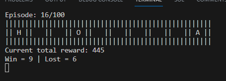
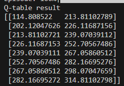

# Q-Learning-Ca-GaIB
Implementation of Q-Learning algorithm in a 1D environment

## Table of Contents
* [General Info](#general-information)
* [Technologies Used](#technologies-used)
* [How to run](#how-to-run)
* [Screenshots](#screenshots)


## General Information
The environment consists of 10 tiles, numbered from 0 to 9. There is a hole on tile 0 and an apple on tile 9. The initial state of the player is on tile 2. The player can move right or left. If the player steps on the hole tile, the reward is -100. If it steps on the apple tile, the reward is +100, else is -1 reward. Player position resets to tile 3 after obtaining an apple or fell in through the hole. The player wins if it has +500 reward losts if it has -200 reward.


## Technologies Used
- python - version 3.10
- numpy - version 1.21.6
- tqdm - version 4.64.0

## How to run
1. Use this command in the root directory of the repository
```
python main.py
```
2. Choose mode (visualized/non-visualized mode)
3. If you choose visualized mode, the program will ask if you want to enable slow mode or not
4. The training will proceed
5. The program will prints the Q-table to the terminal after training is finished

## Screenshots
Visualized mode



Q-table result


